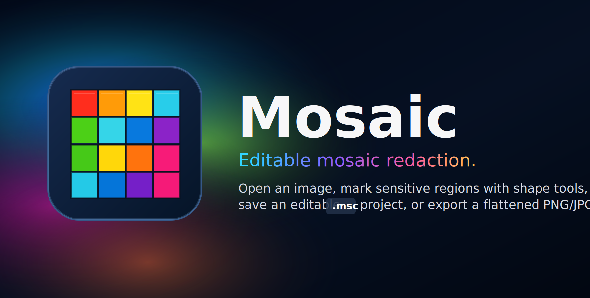

<p align="center">
  
</p>

<p align="center">
  <a href="https://github.com/hololee/mosaic/releases/latest">
    
  </a>
</p>

# Mosaic

Mosaic is an Electron desktop app for non-destructive mosaic redaction. Open an image from disk or the clipboard, mark sensitive regions with shape tools, save an editable `.msc` project, or export a flattened PNG/JPG.

## Run

```bash
npm install
npm start
```

## Build

- [macOS build guide](https://github.com/hololee/mosaic/wiki/macOS-Build)
- [Windows build guide](https://github.com/hololee/mosaic/wiki/Windows-Build)

## Updates

Mosaic checks GitHub Releases for updates after launch. Use `Check for Updates...` from the app menu on macOS or the Help menu on Windows to check manually.

Release builds publish through `electron-updater`, so GitHub Releases must include the generated update metadata alongside installers: `latest.yml`, `latest-mac.yml`, blockmaps, the Windows NSIS installer, and the macOS DMG/ZIP artifacts.

## Shortcuts

- Open: `CmdOrCtrl+O`
- New from Clipboard: `CmdOrCtrl+Alt+V`
- Paste image: `CmdOrCtrl+V`
- Save `.msc`: `CmdOrCtrl+S`
- Save As `.msc`: `CmdOrCtrl+Shift+S`
- Export Image: `CmdOrCtrl+Shift+E`
- Export to Clipboard: `CmdOrCtrl+Alt+C`
- Check for Updates: `CmdOrCtrl+Alt+U`
- Undo/Redo: `CmdOrCtrl+Z`, `CmdOrCtrl+Shift+Z`
- Tools: `R`, `O`, `L`, `B`, `E`, `H`

## Project Files

`.msc` files are JSON project documents containing the original image data URL, editable mask geometry, and editor settings. Exported PNG/JPG files are flattened images with the mosaic permanently applied.
